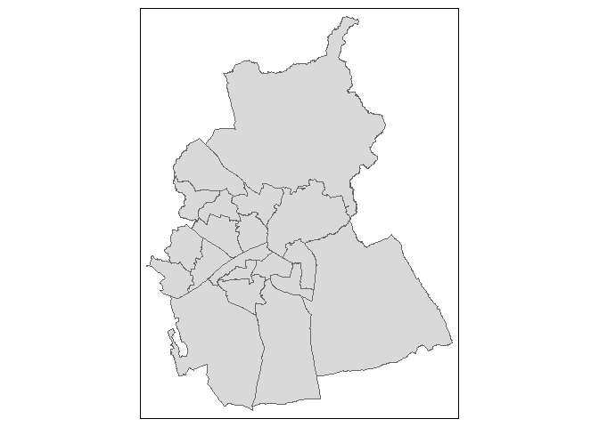
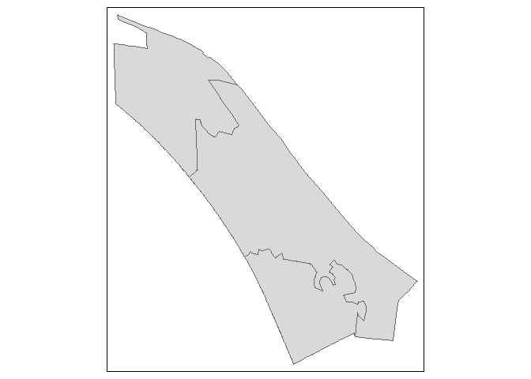

<!-- README.md is generated from README.Rmd. Please edit that file -->

# jogger

<!-- badges: start -->
<!-- badges: end -->

### Retrieve area boundaries and data from the ONS Open Geography Portal

The main function of this package is to download area lookups and
boundaries (in GeoJSON format) using the ONS Open Geography API, for all
sub-areas - at a specified level - within a specified area. The main
script will return a data frame with the sub-area geometry column, as an
`sf` object ready to be visualised as a map. It’s initially just for
areas within England and Wales, with a hope to add Scottish geographies
at a later date. And currently just for the following area levels: LSOA,
MSOA, Ward, LAD/LTLA, UTLA, CAUTH, RGN *\[subject to change\]*

*Changes since 2019 (currently – Jan 2021 – just the change in
Buckinghamshire from two-tier to unitary) are not yet incorporated.*

## Installation

    remotes::install_github("francisbarton/jogger")

## Examples

``` r
library(jogger)
library(tmap)

tmap::tmap_mode("plot")
#> tmap mode set to plotting

geo_get("wd", "Swindon", "lad") %>% 
  tmap::qtm()
#> Reading layer `ESRIJSON' from data source `https://services1.arcgis.com/ESMARspQHYMw9BZ9/arcgis/rest/services/Wards_December_2019_Boundaries_UK_BFC_v2/FeatureServer/0/query?where=%20(WD19CD%20%3D%20%27E05008954%27%20OR%20WD19CD%20%3D%20%27E05008955%27%20OR%20WD19CD%20%3D%20%27E05008956%27%20OR%20WD19CD%20%3D%20%27E05008957%27%20OR%20WD19CD%20%3D%20%27E05008958%27%20OR%20WD19CD%20%3D%20%27E05008960%27%20OR%20WD19CD%20%3D%20%27E05008961%27%20OR%20WD19CD%20%3D%20%27E05008962%27%20OR%20WD19CD%20%3D%20%27E05008963%27%20OR%20WD19CD%20%3D%20%27E05008965%27%20OR%20WD19CD%20%3D%20%27E05008966%27%20OR%20WD19CD%20%3D%20%27E05008967%27%20OR%20WD19CD%20%3D%20%27E05008968%27%20OR%20WD19CD%20%3D%20%27E05008969%27%20OR%20WD19CD%20%3D%20%27E05008970%27%20OR%20WD19CD%20%3D%20%27E05008971%27%20OR%20WD19CD%20%3D%20%27E05008972%27%20OR%20WD19CD%20%3D%20%27E05010755%27%20OR%20WD19CD%20%3D%20%27E05010756%27%20OR%20WD19CD%20%3D%20%27E05010757%27)%20&outFields=WD19CD&outSR=4326&f=json' using driver `ESRIJSON'
#> Simple feature collection with 20 features and 1 field
#> geometry type:  POLYGON
#> dimension:      XY
#> bbox:           xmin: -1.865128 ymin: 51.48245 xmax: -1.602812 ymax: 51.69271
#> geographic CRS: WGS 84
#> Joining, by = "wd19cd"
#> Linking to GEOS 3.8.0, GDAL 3.0.4, PROJ 6.3.1
```



``` r
geo_get("msoa", "Swansea", "lad", return_centroids = TRUE) %>% 
  tmap::qtm()
#> Joining, by = c("lad19cd", "lad19nm")
#> 
#> -- Column specification --------------------------------------------------------
#> cols(
#>   msoa11cd = col_character(),
#>   msoa11nm = col_character(),
#>   msoa11nmw = col_character(),
#>   msoa11hclnm = col_character(),
#>   msoa11hclnmw = col_character(),
#>   Laname = col_character()
#> )
#> Joining, by = "msoa11nm"
#> Joining, by = c("lsoa11cd", "lsoa11nm")
#> Joining, by = c("lsoa11cd", "lsoa11nm")
#> Reading layer `ESRIJSON' from data source `https://ons-inspire.esriuk.com/arcgis/rest/services/Census_Boundaries/Middle_Super_Output_Areas_December_2011_Centroids/MapServer/0/query?where=%20(msoa11cd%20%3D%20%27W02000192%27%20OR%20msoa11cd%20%3D%20%27W02000179%27%20OR%20msoa11cd%20%3D%20%27W02000190%27%20OR%20msoa11cd%20%3D%20%27W02000191%27%20OR%20msoa11cd%20%3D%20%27W02000183%27%20OR%20msoa11cd%20%3D%20%27W02000174%27%20OR%20msoa11cd%20%3D%20%27W02000193%27%20OR%20msoa11cd%20%3D%20%27W02000169%27%20OR%20msoa11cd%20%3D%20%27W02000184%27%20OR%20msoa11cd%20%3D%20%27W02000180%27%20OR%20msoa11cd%20%3D%20%27W02000182%27%20OR%20msoa11cd%20%3D%20%27W02000187%27%20OR%20msoa11cd%20%3D%20%27W02000185%27%20OR%20msoa11cd%20%3D%20%27W02000172%27%20OR%20msoa11cd%20%3D%20%27W02000171%27%20OR%20msoa11cd%20%3D%20%27W02000177%27%20OR%20msoa11cd%20%3D%20%27W02000173%27%20OR%20msoa11cd%20%3D%20%27W02000195%27%20OR%20msoa11cd%20%3D%20%27W02000198%27%20OR%20msoa11cd%20%3D%20%27W02000168%27%20OR%20msoa11cd%20%3D%20%27W02000188%27%20OR%20msoa11cd%20%3D%20%27W02000197%27%20OR%20msoa11cd%20%3D%20%27W02000194%27%20OR%20msoa11cd%20%3D%20%27W02000189%27%20OR%20msoa11cd%20%3D%20%27W02000196%27)%20&outFields=msoa11cd&outSR=4326&f=json' using driver `ESRIJSON'
#> Simple feature collection with 25 features and 1 field
#> geometry type:  POINT
#> dimension:      XY
#> bbox:           xmin: -4.126412 ymin: 51.57293 xmax: -3.877518 ymax: 51.71417
#> geographic CRS: WGS 84
#> Reading layer `ESRIJSON' from data source `https://ons-inspire.esriuk.com/arcgis/rest/services/Census_Boundaries/Middle_Super_Output_Areas_December_2011_Centroids/MapServer/0/query?where=%20(msoa11cd%20%3D%20%27W02000181%27%20OR%20msoa11cd%20%3D%20%27W02000170%27%20OR%20msoa11cd%20%3D%20%27W02000175%27%20OR%20msoa11cd%20%3D%20%27W02000176%27%20OR%20msoa11cd%20%3D%20%27W02000178%27%20OR%20msoa11cd%20%3D%20%27W02000186%27)%20&outFields=msoa11cd&outSR=4326&f=json' using driver `ESRIJSON'
#> Simple feature collection with 6 features and 1 field
#> geometry type:  POINT
#> dimension:      XY
#> bbox:           xmin: -3.969916 ymin: 51.6284 xmax: -3.908663 ymax: 51.67981
#> geographic CRS: WGS 84
#> Joining, by = "msoa11cd"
```


``` r
geo_get("lsoa", "Zetland", "ward", spatial_ref = 3857) %>% 
  tmap::qtm()
#> Reading layer `ESRIJSON' from data source `https://services1.arcgis.com/ESMARspQHYMw9BZ9/arcgis/rest/services/Lower_Layer_Super_Output_Areas_December_2011_Boundaries_EW_BFC_v3/FeatureServer/0/query?where=%20(LSOA11CD%20%3D%20%27E01012186%27%20OR%20LSOA11CD%20%3D%20%27E01012185%27%20OR%20LSOA11CD%20%3D%20%27E01012184%27)%20&outFields=LSOA11CD&outSR=3857&f=json' using driver `ESRIJSON'
#> Simple feature collection with 3 features and 1 field
#> geometry type:  POLYGON
#> dimension:      XY
#> bbox:           xmin: -117993 ymin: 7285060 xmax: -115362.4 ymax: 7288090
#> projected CRS:  WGS 84 / Pseudo-Mercator
#> Joining, by = "lsoa11cd"
```



``` r
geo_get(bounds_level = "lad",
        within = "Gloucestershire",
        within_level = "cty",
        return_style = "simple",
        return_boundaries = FALSE)
#>     lad19cd        lad19nm   cty19cd         cty19nm
#> 1 E07000078     Cheltenham E10000013 Gloucestershire
#> 2 E07000079       Cotswold E10000013 Gloucestershire
#> 3 E07000080 Forest of Dean E10000013 Gloucestershire
#> 4 E07000081     Gloucester E10000013 Gloucestershire
#> 5 E07000082         Stroud E10000013 Gloucestershire
#> 6 E07000083     Tewkesbury E10000013 Gloucestershire
```

Return a bare API query ready to be run or checked externally:

``` r
build_api_query(
  # currently you just have to know which ref to use - see build_api_query.R
  table_code_ref = 2, 
  within_level = "cauth19nm",
  within = "Greater Manchester"
)
#> [1] "https://services1.arcgis.com/ESMARspQHYMw9BZ9/arcgis/rest/services/LAD19_CAUTH19_EN_LU/FeatureServer/0/query?where=%20(CAUTH19NM%20%3D%20%27GREATER%20MANCHESTER%27)%20&outFields=*&returnDistinctValues=true&outSR=4326&f=json"
```

## Contributing

Suggestions are welcome, preferably posted as an issue on GitHub.
Contributions as pull requests are also welcome.

You are also welcome to email me with comments or ideas. I’d be glad of
suggestions for improvement, or extra features.

Improvements to the naming of key functions and their parameters
especially welcome.

Contact details are on my GitHub profile.

This project has a Contributor Code of Conduct:

### Code of Conduct

Please note that the `jogger` project is released with a [Contributor
Code of
Conduct](https://contributor-covenant.org/version/2/0/CODE_OF_CONDUCT.html).
By contributing to this project, you agree to abide by its terms.

## News

See NEWS.md for version notes

### Licences

The code in this repo is MIT licensed.

The data that the code helps you retrieve is issued under a variety of
licences, including:

-   the [Open Government Licence
    v3.0](https://www.nationalarchives.gov.uk/doc/open-government-licence/version/3/)

> Licensing statement [as stipulated by the
> ONS](https://www.ons.gov.uk/methodology/geography/licences):
>
> -   Source: Office for National Statistics licensed under the [Open
>     Government Licence
>     v3.0](https://www.nationalarchives.gov.uk/doc/open-government-licence/version/3/)
> -   Contains OS data © Crown copyright and database right 2021.
