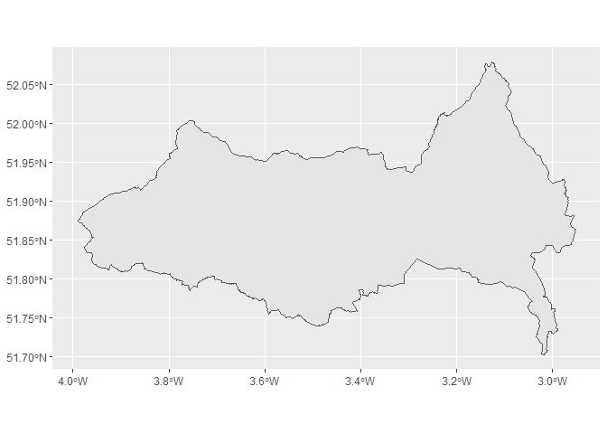
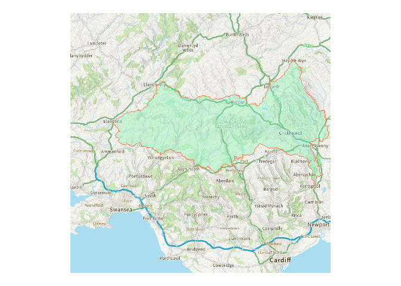

<!-- README.md is generated from README.qmd. Please edit that file -->

# welcome to boundr

<!-- badges: start -->

[](https://opensource.org/licenses/MIT)
<!-- badges: end -->

### Retrieve area boundaries and data from the ONS Open Geography Portal

<div style="display: flex; align-items: center;">

<div style="flex: 0 0 auto; margin-right: 20px;">

 <br clear="all" />

</div>

<div>

The main purpose of this package is to download area lookups and
boundaries to R tables, using the ONS Open Geography API, for all areas
at a specified level within a specified area.

The main script `bounds()` will return a data frame with the sub-area
geometry column, as an `sf` object ready to be visualised as a map.

</div>

</div>

## Installation

You can install this package from the `R` console by entering

> remotes::install_git(“https://codeberg.org/francisbarton/boundr”)

if you have the `remotes` package installed.

## Examples

### Basic lookup of areas within a larger area, by name

Returns `sfc` tibble with latest available data

``` r
bounds("msoa", "lad", "Swansea")
```

    Simple feature collection with 30 features and 7 fields
    Geometry type: MULTIPOLYGON
    Dimension:     XY
    Bounding box:  xmin: -4.333587 ymin: 51.53577 xmax: -3.842747 ymax: 51.77423
    Geodetic CRS:  WGS 84
    # A tibble: 30 × 8
       msoa21cd  msoa21nm    lad24cd   lad24nm msoa21nmw    msoa21hclnm msoa21hclnmw
       <chr>     <chr>       <chr>     <chr>   <chr>        <chr>       <chr>       
     1 W02000168 Swansea 001 W06000011 Swansea Abertawe 001 Pontarddul… Pontarddula…
     2 W02000169 Swansea 002 W06000011 Swansea Abertawe 002 Clydach & … Clydach a M…
     3 W02000170 Swansea 003 W06000011 Swansea Abertawe 003 Morriston … Gogledd Tre…
     4 W02000171 Swansea 004 W06000011 Swansea Abertawe 004 Llangyfela… Llangyfelac…
     5 W02000172 Swansea 005 W06000011 Swansea Abertawe 005 Gorseinon   Gorseinon   
     6 W02000173 Swansea 006 W06000011 Swansea Abertawe 006 Birchgrove  Gellifedw   
     7 W02000174 Swansea 007 W06000011 Swansea Abertawe 007 Loughor     Casllwchwr  
     8 W02000175 Swansea 008 W06000011 Swansea Abertawe 008 Morriston … De Treforys 
     9 W02000176 Swansea 009 W06000011 Swansea Abertawe 009 Mynydd-bach Mynydd-bach 
    10 W02000177 Swansea 010 W06000011 Swansea Abertawe 010 Llansamlet  Llansamlet  
    # ℹ 20 more rows
    # ℹ 1 more variable: geometry <MULTIPOLYGON [°]>

### Lookup areas with older dates

Trial and error may be required - or start by looking up what is
available on the OpenGeography site.

``` r
bounds("wd", "lad", "Shepway", within_year = 2016) # Shepway no longer exists
```

    Simple feature collection with 13 features and 4 fields
    Geometry type: POLYGON
    Dimension:     XY
    Bounding box:  xmin: 0.7768709 ymin: 50.91048 xmax: 1.221268 ymax: 51.205
    Geodetic CRS:  WGS 84
    # A tibble: 13 × 5
       wd16cd    wd16nm                    lad16cd lad16nm                  geometry
       <chr>     <chr>                     <chr>   <chr>               <POLYGON [°]>
     1 E05010015 Broadmead                 E07000… Shepway ((1.155543 51.08448, 1.1…
     2 E05010016 Cheriton                  E07000… Shepway ((1.159752 51.10128, 1.1…
     3 E05010017 East Folkestone           E07000… Shepway ((1.184824 51.09986, 1.1…
     4 E05010018 Folkestone Central        E07000… Shepway ((1.177906 51.07553, 1.1…
     5 E05010019 Folkestone Harbour        E07000… Shepway ((1.184824 51.09986, 1.1…
     6 E05010020 Hythe                     E07000… Shepway ((1.119319 51.08961, 1.1…
     7 E05010021 Hythe Rural               E07000… Shepway ((1.036358 51.08556, 1.0…
     8 E05010022 New Romney                E07000… Shepway ((0.9804397 51.00251, 0.…
     9 E05010023 North Downs East          E07000… Shepway ((1.147638 51.17718, 1.1…
    10 E05010024 North Downs West          E07000… Shepway ((1.097309 51.18892, 1.0…
    11 E05010025 Romney Marsh              E07000… Shepway ((1.035288 51.04665, 1.0…
    12 E05010026 Sandgate & West Folkesto… E07000… Shepway ((1.155534 51.08386, 1.1…
    13 E05010027 Walland & Denge Marsh     E07000… Shepway ((0.8944822 51.03699, 0.…

### You can just request bare lookup tables - no spatial data attached

``` r
lookup("spc", "spr")
```

    # A tibble: 73 × 4
       spc23cd   spc23nm                        spr23cd   spr23nm              
       <chr>     <chr>                          <chr>     <chr>                
     1 S16000083 Argyll and Bute                S17000011 Highlands and Islands
     2 S16000086 Caithness, Sutherland and Ross S17000011 Highlands and Islands
     3 S16000110 Na h-Eileanan an Iar           S17000011 Highlands and Islands
     4 S16000125 Inverness and Nairn            S17000011 Highlands and Islands
     5 S16000132 Moray                          S17000011 Highlands and Islands
     6 S16000135 Orkney Islands                 S17000011 Highlands and Islands
     7 S16000142 Shetland Islands               S17000011 Highlands and Islands
     8 S16000143 Skye, Lochaber and Badenoch    S17000011 Highlands and Islands
     9 S16000080 Almond Valley                  S17000012 Lothian              
    10 S16000104 Edinburgh Central              S17000012 Lothian              
    # ℹ 63 more rows

Sometimes boundr needs a little help finding what you are looking for.
Supplying a year or country filter can help get the right table.

### A lookup table for wards to Senedd electoral regions

Using `return_with = "full"` includes all available columns, not just
those referred to by the `lookup_level` and `within_level` arguments.

``` r
lookup("wd", "sener", opts = opts(return_width = "full"))
```

    # A tibble: 764 × 9
       wd23cd    wd23nm wd23nmw ua23cd ua23nm ua23nmw sener23cd sener23nm sener23nmw
       <chr>     <chr>  <chr>   <chr>  <chr>  <chr>   <chr>     <chr>     <chr>     
     1 W05001492 Aethwy Aethwy  W0600… Isle … Ynys M… W10000001 North Wa… Gogledd C…
     2 W05001493 Bodow… Bodowyr W0600… Isle … Ynys M… W10000001 North Wa… Gogledd C…
     3 W05001494 Bro A… Bro Ab… W0600… Isle … Ynys M… W10000001 North Wa… Gogledd C…
     4 W05001495 Bro'r… Bro'r … W0600… Isle … Ynys M… W10000001 North Wa… Gogledd C…
     5 W05001496 Canol… Canolb… W0600… Isle … Ynys M… W10000001 North Wa… Gogledd C…
     6 W05001497 Cefni  Cefni   W0600… Isle … Ynys M… W10000001 North Wa… Gogledd C…
     7 W05001498 Crigy… Crigyll W0600… Isle … Ynys M… W10000001 North Wa… Gogledd C…
     8 W05001499 Lligwy Lligwy  W0600… Isle … Ynys M… W10000001 North Wa… Gogledd C…
     9 W05001500 Parc … Parc a… W0600… Isle … Ynys M… W10000001 North Wa… Gogledd C…
    10 W05001501 Seiri… Seiriol W0600… Isle … Ynys M… W10000001 North Wa… Gogledd C…
    # ℹ 754 more rows

### The sfc tibble is ready to be passed to a mapping tool like `tmap::qtm()`

(Here I’ve chosen to do something a little more complex with `tmap`, but
`qtm()` works too).

``` r
bounds("par", "lad", "Isles of Scilly") |>
  tmap::tm_shape() +
  tmap::tm_polygons(
    col = "par23nm",
    palette = "-Accent",
    legend.show = FALSE,
    border.col = "grey40"
  ) +
  tmap::tm_style("natural", bg.color = "#7cb7bb")
```


### bounds now supports a shortcut syntax…

…which will return all bounds for a certain level, without having to
specify a `within_level` argument

Take care - you might download a lot of data doing this!

``` r
bounds("spr")
```

    Simple feature collection with 8 features and 2 fields
    Geometry type: MULTIPOLYGON
    Dimension:     XY
    Bounding box:  xmin: -8.649996 ymin: 54.63326 xmax: -0.7246158 ymax: 60.86077
    Geodetic CRS:  WGS 84
    # A tibble: 8 × 3
      spr22cd   spr22nm                                                     geometry
      <chr>     <chr>                                             <MULTIPOLYGON [°]>
    1 S17000011 Highlands and Islands (((-5.572266 55.28656, -5.570243 55.28481, -5…
    2 S17000012 Lothian               (((-3.17174 55.9875, -3.17105 55.98732, -3.17…
    3 S17000013 Mid Scotland and Fife (((-3.302574 56.03094, -3.302508 56.03033, -3…
    4 S17000014 North East Scotland   (((-2.531457 56.71581, -2.530777 56.71507, -2…
    5 S17000015 South Scotland        (((-4.085281 54.7686, -4.084491 54.7683, -4.0…
    6 S17000018 West Scotland         (((-5.118861 55.42869, -5.118397 55.42741, -5…
    7 S17000019 Central Scotland      (((-3.795887 56.10006, -3.795648 56.09964, -3…
    8 S17000020 Glasgow               (((-4.271141 55.9281, -4.270303 55.92808, -4.…

### The “centroids” option returns area centroids where available

These are usually population-weighted (PWC) nowadays. (Some older
centroids are address-weighted (AWC). Check the OpenGeography website).

``` r
sb <- bounds("msoa", "lad", "Swindon")
sp <- bounds("msoa", "utla", "Swindon", geometry = "centroids")

sb |>
  ggplot2::ggplot() +
  ggplot2::geom_sf(colour = "grey33", fill = "grey95") +
  ggplot2::geom_sf(data = sp, colour = "orange") +
  ggplot2::theme_void()
```


### A ggplot2 example

Here we specify a ‘within_names’ argument alongside the ‘lookup’
argument. There’s no ‘within_level’ argument to be specified because
there’s nothing to lookup against. (There aren’t any lookup tables for
National Parks - just the boundaries).

``` r
bounds("npark", within_names = "Bannau Brycheiniog") |>
  ggplot2::ggplot() +
  ggplot2::geom_sf()
```



``` r
# https://github.com/francisbarton/mapirosa
library(mapirosa)

# https://dieghernan.github.io/tidyterra/reference/geom_spatraster_rgb.html
library(tidyterra)

bb <- bounds(
  "npark",
  within_names = "Bannau Brycheiniog",
  opts = boundr_options(crs = 27700)
)

bb_basemap <- mapirosa::build_basemap(
  bbox = sf::st_bbox(bb),
  zoom = 3,
  style = "outdoor",
  squarify = TRUE,
  crs = 27700
) |>
  rlang::with_interactive(FALSE)

ggplot2::ggplot(bb) +
  tidyterra::geom_spatraster_rgb(
    data = bb_basemap,
    maxcell = 1e7,
    max_col_value = 1
  ) +
  ggplot2::theme_void() +
  ggplot2::geom_sf(colour = "coral", fill = "aquamarine", alpha = 0.3)
```



## Package internal structure

The structure of the project looks a bit like this:

    bounds() [main UI function]
       ^
       |
       |
       ------- <----- add_geometry_to_table() [also available to user]
       |      |
       |      |
       |      lookup() [main function available to the user]
       |                ^
       |                |
       |                |
       |                 <-------- return_table_info() 
       |                                       \
       |                                        \
        <------- return_spatial_data()           <----- opengeo_schema
                        ^                       /          [pkg data]
                        |                      /               ^
                         <-------- return_bounds_info()        |
                                                          build_schema()

When you call `bounds()` you specify a lower level area (eg ward) and a
higher level area (eg local authority), and you specify either the name
of the higher level area (or areas) or its ONS code. Multiple higher
level areas can be submitted. If no higher level area is specified then
boundaries or a lookup will be returned directly (without an
intermediate lookup table being created).

`return_table_info()` then finds the API query URL of a suitable lookup
table - one that contains columns for both your lower and higher level
areas. It does this by filtering `opengeo_schema`, which is a cached
copy of the various datasets available from the Open Geography API
Services list. This schema is available as internal data in the
package,and is updated periodically by the maintainer but may be
slightly out of date.

`lookup()` then builds a lookup table (a tibble) based on all the areas
you have said you are interested in.

At the same time, `return_spatial_data()` will - if you have specified
you want spatial boundaries data for your areas - retrieve the boundary
data at your chosen resolution for your lower level areas. These will
then be joined onto the lookup table and provided to you as an `sfc`
tibble.

## Contributing

Suggestions for improvements are welcome, preferably posted as an issue
on Codeberg (or GitHub). Contributions as pull requests are also
welcome.

Please note that `boundr` is released with a [Contributor Code of
Conduct](https://contributor-covenant.org/version/2/0/CODE_OF_CONDUCT.html).
By contributing to this project, you agree to abide by its terms.

## News

See [NEWS.md](NEWS.md) for version notes.

`boundr` was previously
[`jogger`](https://github.com/francisbarton/jogger).

### Licences

The code in this repo is MIT licensed.

The data that the code helps you retrieve is issued under a variety of
licences, including:

- the [Open Government Licence
  v3.0](https://www.nationalarchives.gov.uk/doc/open-government-licence/version/3/)

> Licensing statement [as stipulated by the
> ONS](https://www.ons.gov.uk/methodology/geography/licences):
>
> - Source: Office for National Statistics licensed under the [Open
>   Government Licence
>   v3.0](https://www.nationalarchives.gov.uk/doc/open-government-licence/version/3/)
> - Contains OS data © Crown copyright and database right 2024
